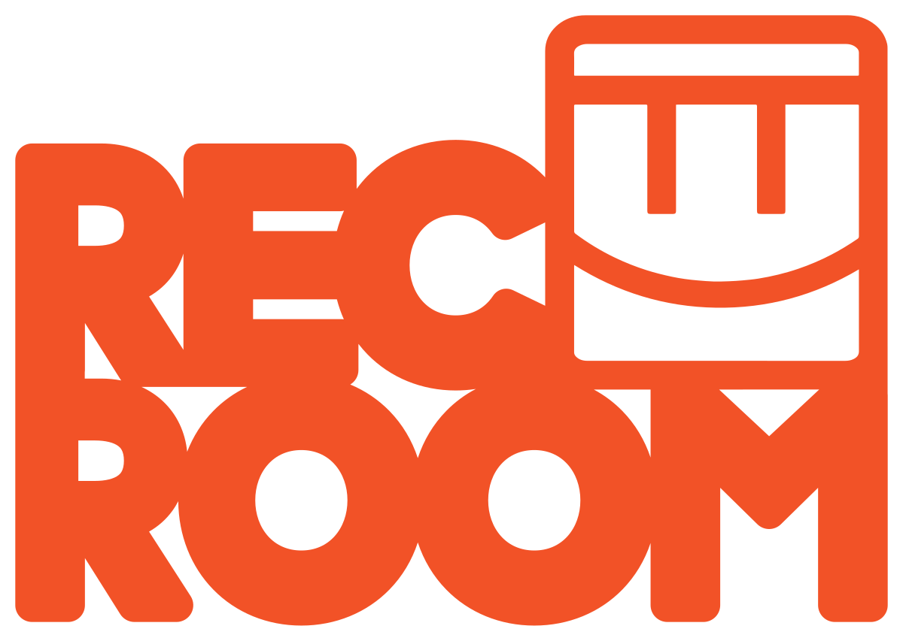

  

# Rec Room — Final Countdown

## What is this?

This is a countdown website for Rec Room.

It counts down to June 1st, 2026, and then plays a full ending sequence.
Basically just something cool I made as a goodbye/tribute.

---

## What it does

* Shows a live countdown
* Plays Rec Room music
* Has a progress bar from 2016 → 2026
* Background animations (embers, glow, etc)
* Button to trigger the ending early

---

## The ending

When the countdown hits 0 (or you press the button):

* Everything gets sucked into a black hole
* A slideshow of photos plays
* A goodbye message shows
* Then some extra scenes after that

---

## How to use

1. Put everything in the same folder
2. Open `index.html`
3. Click anywhere to start music

---

## Files you need

* `logo.png`
* All the `.mp3` files
* `imgs.json` (for photos, optional)

---

## Thats it

just a cool lil project 👍
